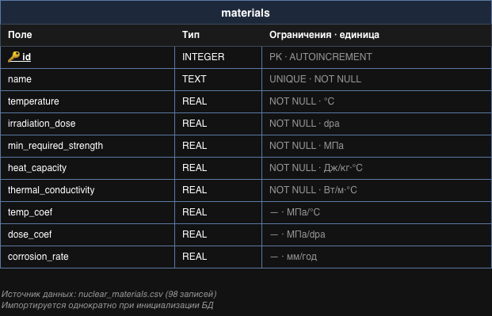

# Модель данных

## Описание

Система **NukeMatPredictor** использует **одну таблицу** в базе данных SQLite — `materials`. Все остальные структуры (введённые пользователем параметры, результаты расчёта, точки графиков) формируются в оперативной памяти приложения и в БД не сохраняются, поэтому в модели данных не отражены.

## Таблица `materials`

Таблица хранит характеристики ядерных материалов. Каждая запись соответствует одному материалу.

| Поле                    | Тип     | Ограничения                  | Единица      | Описание                                          |
|-------------------------|---------|------------------------------|--------------|---------------------------------------------------|
| `id`                    | INTEGER | **PRIMARY KEY**, AUTOINCREMENT | —          | Уникальный идентификатор материала                |
| `name`                  | TEXT    | UNIQUE, NOT NULL             | —            | Название материала (например, «Сталь 12Х18Н10Т») |
| `temperature`           | REAL    | NOT NULL                     | °C           | Рабочая температура                               |
| `irradiation_dose`      | REAL    | NOT NULL                     | dpa          | Доза нейтронного облучения                        |
| `min_required_strength` | REAL    | NOT NULL                     | МПа          | Минимально допустимая прочность                   |
| `heat_capacity`         | REAL    | NOT NULL                     | Дж/(кг·°C)   | Удельная теплоёмкость                             |
| `thermal_conductivity`  | REAL    | NOT NULL                     | Вт/(м·°C)    | Теплопроводность                                  |
| `temp_coef`             | REAL    | —                            | МПа/°C       | Температурный коэффициент изменения прочности     |
| `dose_coef`             | REAL    | —                            | МПа/dpa      | Дозовый коэффициент изменения прочности           |
| `corrosion_rate`        | REAL    | —                            | мм/год       | Скорость коррозии                                 |

**Объём данных:** 98 записей.

## Источник данных

Таблица `materials` инициализируется однократным импортом из файла **`nuclear_materials.csv`** при первом запуске приложения. После загрузки CSV-файл больше не используется — все запросы выполняются непосредственно к SQLite.

## Связи

В текущей версии модель содержит только одну сущность. Связи между таблицами отсутствуют, поскольку других таблиц в БД нет.

## ER-диаграмма

Графическое представление модели:
- Исходник: `data_model.drawio` (открывается в [draw.io](https://www.drawio.com))
- Превью: `data_model.png`

